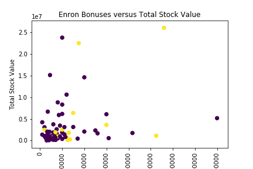

# Enron:
## Identifying Persons of Interest with Machine Learning
-Tom Nececkas

### Goal of Project

Enron is the biggest corporate fraud case in U.S. history.  The company went from being one of the ten largest U.S. companies in 2000, to being bankrupt in 2002.  In the aftermath of Enron's collapse, dozens of its employees went to prison.  Also, a large amount of financial information and emails were made available to the public.  

The aim of this project is to look at whether a machine learning algorithm could use the financial and email information to identify persons of interest to the fraud investigation.  A person of interest includes someone who was indicted, sentenced to prison, or accepted immunity in exchange for their cooperation.  

Note: In most of this document, a "person of interest" will be abbreviated to a "poi".

### Outliers

When I received the dataset file (final_project_dataset.pkl), I converted the dataset into a dataframe using the pandas module in order to explore the dataset. When I looked at the data for loan_advances, I noticed that most of the records lacked values.

```python 
import pandas as pd
from collections import Counter

data_dict = pd.read_pickle('final_project_dataset.pkl')
df = pd.DataFrame.from_dict(data_dict, orient='index')
Counter(df.loan_advances)
```
```
NaN.............. 142
400,000............ 1
2,000,000.......... 1
81,525,000......... 1
83,925,000......... 1
```

Since receiving a loan advance was so unusual, I decided to look at the individuals who received advances.  I edited the results table to show the relevant data.

```python 
df[df.loan_advances != 'NaN']
```

name               |       loan_advances      |    poi
:----------------- | :----------------------- | :--------
FREVERT MARK A     | 2000000                  | False
LAY KENNETH L      | 81525000                 | True
PICKERING MARK R   | 400000                   | False
TOTAL              | 83925000                 | False

The record for 'TOTAL' is an outlier and certainly doesn't belong in a list of individuals.

Kenneth L Lay also appears as an outlier for loan_advances.  This isn't a surprise.  Ken Lay was Enron's founder, as well as its CEO and Chairman of its Board of Directors during most of the company's existence.  While Ken Lay's financial data also stands out in some other categories, including total_payments and total_stock_value, his financial information doesn't stand out in all categories.  I decided to leave Ken Lay in the dataset because he is a poi and his financial information doesn't always suggest he's an outlier, so I didn't think his inclusion would negatively impact the modelling.

While reviewing the dataset to make sure an unrelated bit of code worked, I happened to notice the dataset also included a record for 'THE TRAVEL AGENCY IN THE PARK'. Since I am only interested in individuals, I also removed this record.

While looking at records which were missing information in basic categories (using the below code), I noticed that one record didn't have a value for any feature: 'LOCKHART EUGENE E'.

```python
df[(df.salary == 'NaN') & (df.deferral_payments == 'NaN') & 
   (df.restricted_stock == 'NaN') & (df.total_payments == 'NaN')]
```

I used the below code to remove 'TOTAL' and 'THE TRAVEL AGENCY IN THE PARK' from data_dict, a dictionary that contains all the records in the dataset:

```python 
data_dict = {k:v for k,v in data_dict.items() if k not in ['TOTAL', 
    'LOCKHART EUGENE E', 'THE TRAVEL AGENCY IN THE PARK']}
```

### Basic Statistics of Dataset

After removing the outliers, I used the below code to get basic statistics about the number of data points and poi's in the dataset.

```python
from collections import Counter
print("Basic stats:")
print("Number of data points: ", len(labels))
print("Number of pois: ", Counter(labels))
```

There are 143 records in the dataset, each of which represents one individual.  Of those 143 persons, 18 are persons of interest.

### Feature Engineering
 
I created new features based on the features already included in the dataset.

For example, with regards to emails, I wondered whether the absolute number of emails from a poi to a person was significant.  If a person received a huge number of emails (such as, perhaps, the director of Human Reources), receiving emails from a poi wouldn't actually be suspicious.  Therefore, I decided to compute the <i>proportion</i> of emails to a person that were from a poi.  I also computed a similar proportion with respect to the number of emails from a person to a poi.

Similar to my speculation about the absolute number of emails, I wondered whether absolute measures of compensation would be a good indicator of poi's.  Although I expected poi's to personally profit in some way from the fraud, I also expected other officers at a huge company to well-compensated.  I wondered whether the total level of compensation might be less important than <i>how the person was compensated</i>.  To test that hypothesis, I found the proportion of total payments that came from a person's bonus.

I used the following code to create these new features.

```python 
def make_new_feature(feature_name, input1, input2):
    if v[input1] == 'NaN' or v[input2] == 'NaN':
        v[feature_name] = 'NaN'
    else:
        v[feature_name] = int(v[input1]) / int(v[input2])

for k, v in data_dict.items():
    make_new_feature('prop_of_total_payments_was_bonus', 'bonus', 'total_payments')
    make_new_feature('prop_emails_from_poi_to_person', 'from_poi_to_this_person', 'to_messages')
    make_new_feature('prop_emails_to_poi_from_person', 'from_this_person_to_poi', 'from_messages')
```

### Feature Selection

As discussed below, I used a Gaussian Naive Bayes algorithm and stratified shuffle split to train and validate the model on different cross-sections of the data. This is important to mention when discussing feature selection, because it prompted me to take a slightly different approach to feature selection.  

I wanted to perform feature selection on only training data, since using testing data in feature selection could invalidate the results of validation.  Since the training data would be different in each cross-section, that meant I needed to perform feature selection on each cross-section.  However, that also meant that different features could be selected for different cross-sections of training data.

To compensate for this problem, I decided to record how many times a feature was selected and the mean chi2 score for the features across all iterations of the training and validation.  

As a result, the code for feature selection only makes sense when viewed in context, which means also viewing the code for training and validating the Gaussian Naive Bayes algorithm.

The feature selection itself was done using SelectKBest and chi2 scores to measure the correlation of individual features with the poi class identifier.  I chose chi2 scores because the [documentation](http://scikit-learn.org/stable/modules/feature_selection.html#univariate-feature-selection) said chi2 scores were good to use with sparse data, and several features had numbers of missing data (i.e. 'NaN' entries).

```python
precision_scores = []
recall_scores = []
new_features = {}

sss = StratifiedShuffleSplit(n_splits=5, random_state=42)
for train_index, test_index in sss.split(features_scaled, labels):

    # prepare training and testing data for this cross-section
    features_train, features_test = features_scaled[train_index], features_scaled[test_index]
    labels = np.asarray(labels)
    labels_train, labels_test = labels[train_index], labels[test_index]

    # select k best features
    selector = SelectKBest(chi2, k=2)
    selector.fit_transform(features_train, labels_train)
    features_train = selector.transform(features_train)
    features_test = selector.transform(features_test)
    
    # get information on features used in this cross-section
    mask = selector.get_support()
    for bool, feature, chi2_score in zip(mask, potential_features, selector.scores_):
        if bool:
            if feature not in new_features:
                new_features[feature] = [chi2_score]
            else:
                new_features[feature].append(chi2_score)

    # fit GaussianNB model and get recall and precision score for cross-section
    clf.fit(features_train, labels_train)
    pred = clf.predict(features_test)
    precision_scores.append(precision_score(labels_test, pred))
    recall_scores.append(recall_score(labels_test, pred))

print("Features used in model:")
for k, v in new_features.iteritems():
    print("Feature: ", k)
    print("Number of times feature was one of K best: ", len(new_features[k]))
    print("Mean chi2_score: ", np.mean(new_features[k]))

print('Precision: ', np.mean(precision_scores))    
print('Recall: ', np.mean(recall_scores))
```

I ran the above code several times, each time changing out the value of k in SelectKBest(chi2, k=2). When I selected for different numbers of features, I obtained the below precision and recall scores: 

value for k     |    precision  |   recall
:-------------- | :------------ | :-----------------
2               | 0.60          | 0.50
3               | 0.57          | 0.50
4               | 0.57          | 0.50
5               | 0.57          | 0.50

Using only two features in the model slighly increased the precision of the model, while having no impact on the recall of the model.  For that reason, I chose to use two features.

In each iteration, the same two features had the highest chi2 scores.

feature                           |    # of times selected   |    mean chi2 score
:-------------------------------- | :----------------------- | :-----------------
prop_of_total_payments_was_bonus  | 5                        | 9.12
exercised_stock_options           | 5                        | 4.61


Since the same two features were selected by the most iterations and had the highest mean chi2 scores, namely the prop_of_total_payments_was_bonus and exercised_stock_options, it was easy to conclude that these were the best two features to use.  

On a side note, I was pleased that the feature with the highest chi2 score was one of the features I had created.

### Feature Scaling

Ultimately, I used a Gaussian Naive Bayes algorithm, as discussed below.  Typically, a Gaussian Naive Bayes algorithm would not require features to be scaled.  Usually feature scaling is more important for algorithms like support vector machines, where the model depends on accurately computing the distance between data points of different classes.

However, as discussed in the section above on feature selection, I used chi2 scores to determine which features to include in the Gaussian Naive Bayes model. Chi2 scores only work with positive values, and the Enron dataset contained several features with some negative values. So to use the chi2 scores, I first used as min-max scaler to convert all of the features to values between 0 and 1.

```python
from sklearn.preprocessing import MinMaxScaler
scaler = MinMaxScaler()
scaler.fit(features)
features_scaled = scaler.transform(features)
```

### Algorithm Not Chosen (Decision Tree)

Initially, I began testing a decision tree algorithm.  

From the outset, I was concerned about overfitting.  The potential for overfitting is a big drawback with decision trees, particularly when there's a small dataset and a large number of features.  I thought that I might be able to use parameters and a limited number of features to reduce overfitting.

Before trying to highly tune the algorithm, I began by running the decision tree algorithm (with default parameters) on a few different combinations of features.  I quickly found a combination of features that seemed promising:

```python
features_list = ['poi','bonus','total_stock_value','exercised_stock_options']

from sklearn import tree

clf = tree.DecisionTreeClassifier()
clf.fit(features_train, labels_train)
pred = clf.predict(features_test)

print("Feature importances:")
print(clf.feature_importances_)

recall = recall_score(labels_test, pred)
print("Recall: ", recall)
precision = precision_score(labels_test, pred)
print("Precision: ", precision)
```
```
Feature importances:
[0.37996836 0.37847181 0.24155983]
Recall:  0.6
Precision:  0.42857142857142855
```

Because this seemed so initially promising, I decided to look at a scatter plot of the two features with the greatest importance to the model.

```python
x = df.bonus
y = df.total_stock_value

plt.scatter(x, y, c=df.poi)
plt.title('Enron Bonuses versus Total Stock Value')
plt.xlabel('Bonus')
plt.ylabel('Total Stock Value')
plt.xticks(rotation=90)
# plt.show()
plt.savefig('bonus_vs_total_stock_value.png')
```



Looking at the scatter plot, I was concerned about how the decision tree algorithm was turning this (and the exercised_stock_options) into useful data.  This poi's and non-poi's seemed to jumbled together to me, so I was concerned that the decision tree algorithm was overfitting the data when using 3 dimensions.

Even though there are ways I could attempt to mitigate the impact of using the decision tree (e.g. the min_samples_split parameter), the small size of this dataset makes it particularly prone to overfitting.  Despite the promising recall and precision scores, I decided it was safer to use another algorithm.

### Importance of Tuning an Algorithm

Tuning an algorithm's parameters is typically crucial to get an algorithm to work properly.  For example, some algorithms have parameters that control how responsive a model is to new data points, or how much complexity (i.e. number of features) the model is predisposed to achieve.  The parameters that are necessary for an algorithm will vary based on the patterns in the dataset.  If the wrong parameters are chosen, the algorithm could be prone to overfit or underfit the data, or simply have no predictive power at all.  Further below in this section is an example of parameter tuning with an algorithm I did not use: SVC.

Despite the importance of parameter tuning, I actually did not tune the parameters with the two main algorithms that seemed promising.  For the Decision Tree, my reason for not tuning the algorithm was because I decided the downsides of using the algorithm were too great given the nature of the dataset.  For the Gaussian Naive Bayes classifier, there were no parameters to tune. Below is the code I used to tune the SVC algorithm.  Even after tuning, the algorithm returned precision and recall scores of 0.0.  

At the time, I was validating results by looking at only one cross-section of data, so it's possible the results would have been better had I used a stratified shuffle split, but I didn't investigate further because of the very poor results.

For example purposes, below is the code I used to tune the SVC parameters.

```python
from sklearn.model_selection import GridSearchCV
from sklearn.svm import SVC

param_grid = [
    {'C': [1,10,100,1000], 'kernel': ['linear']},
    {'C': [1,10,100,1000], 'gamma': [.01,.001,.0001], 'kernel': ['rbf']},
    {'C': [1,10,100,1000], 'gamma': [.01,.001,.0001], 'degree': [2,3,4], 'kernel': ['poly']}
]

svc = SVC()
clf = GridSearchCV(svc, param_grid)
clf.fit(features_train, labels_train)
pred = clf.predict(features_test)

recall = recall_score(labels_test, pred)
print("Recall: ", recall)
precision = precision_score(labels_test, pred)
print("Precision: ", precision)
```

### Algorithm Selected (Gaussian Naive Bayes)

After trying multiple other algorithms, I found that the Gaussian Naive Bayes algorithm performed best.  With Gaussian Naive Bayes, there were not parameters to tune.

When I ran the code in the section on feature selection above, I obtained the following performance metrics:

Precision: 0.60
Recall: 0.50


### Validation

Validation is crucial in determining whether and to what extend a trained algorithm can make correct predictions about new data.  In this case, that means determining how well the algorithm can identify a person as a poi when given their financial information.

To perform validation, I simply used the code in the section about feature selection.  (This was only possible because the algorithm used the same two features during each iteration.  Had that not been the case, I would have needed to remove code that performed feature selection and specified which two features to use before performing validation.  An example of the code necessary for that is below.)

The biggest problem in validating the classifier was the small amount of data in the dataset, and the even smaller number of poi's in the dataset.  That meant that a classifier's performance could vary greatly by chance&mdash;the chance that a training dataset contained certain records, or even the chance that the testing set contained a disporportionate number of poi's.

To address these issues, I used a stratified shuffle split for validation.  "Stratified" means that the training data and testing data contain the same proportion of poi's.  "Shuffle split" is a way of splitting the dataset into multiple batches of training data and corresponding testing data.  By training and testing on these cross-sections of data, we can minimize the risk that performance metrics are the result of mere chance.

After running the below code, I obtained the following metrics for precision and recall:

```python
precision_scores = []
recall_scores = []

sss = StratifiedShuffleSplit(n_splits=5, random_state=42)
for train_index, test_index in sss.split(features_scaled, labels):

    # prepare training and testing data for this cross-section
    features_train, features_test = features_scaled[train_index], features_scaled[test_index]
    labels = np.asarray(labels)
    labels_train, labels_test = labels[train_index], labels[test_index]

    # fit GaussianNB model and get recall and precision score for cross-section
    clf.fit(features_train, labels_train)
    pred = clf.predict(features_test)
    precision_scores.append(precision_score(labels_test, pred))
    recall_scores.append(recall_score(labels_test, pred))

print('Precision: ', np.mean(precision_scores))    
print('Recall: ', np.mean(recall_scores))
```

Precision: 0.60
Recall: 0.50

A precision of 0.60 means that when the algorithm says someone in new data is a poi, there's about a 60% chance that person is in fact a poi.  A recall of 0.50 means that of all the poi's in new data, the algorithm can find about 50% of them.

These are not great scores for either precision or recall.  This was a small dataset and it was difficult to find an algorithm with better precision and recall scores.  Because these scores are around fairly low, this algorithm could not be the only tool relied on to identify poi's.  On the other hand, this algorithm might be useful to provide a first pass in evaluating corporate fraud cases.
